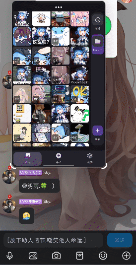
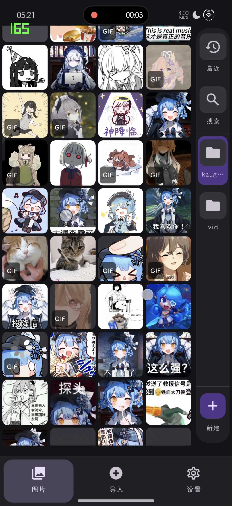
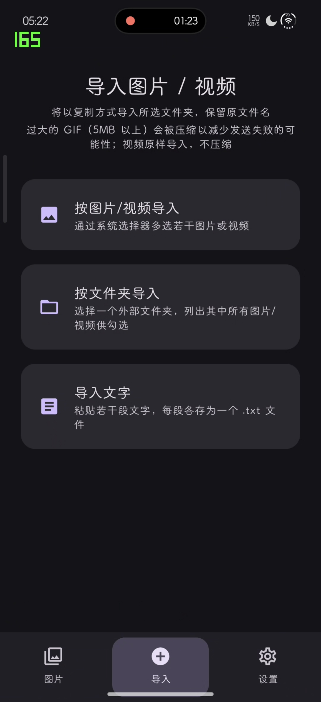
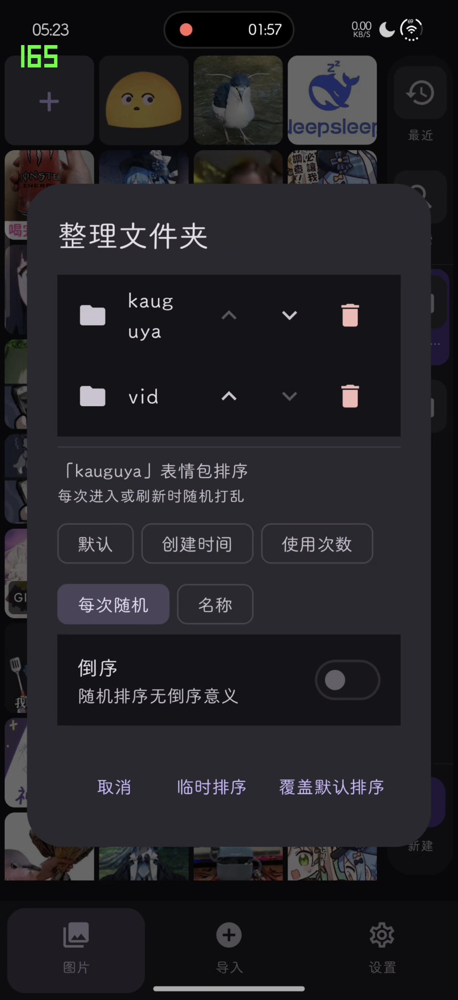
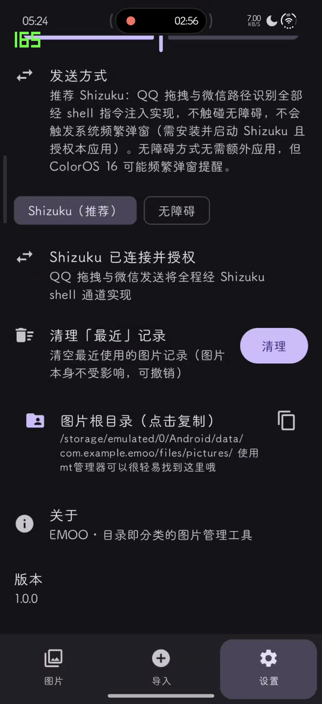

# EMOO

一款以**真实文件目录结构**为基础的 Android 图片分类与「一键发送」工具。核心场景：把常发的表情包 / 图片按文件夹归类，在小窗（分屏 / 悬浮窗）中点一下就把图片发进 QQ、微信聊天窗口——无需走系统分享，也不用切来切去。

## 预览

<p align="center">
  
</p>

<p align="center"><b>小窗一键发送</b>：在 QQ / 微信聊天小窗旁调出 EMOO 悬浮窗，点一下表情包即发送。</p>

| 目录即分类 | 导入 | 整理与排序 | 设置 |
|:---:|:---:|:---:|:---:|
|  |  |  |  |
| 网格浏览，GIF 动图带角标；右侧栏切换文件夹 /「最近」/ 搜索，可随时新建分类 | 按图片、按文件夹、导入文字三种方式；超过 5MB 的 GIF 自动压缩，视频原样导入 | 文件夹可上下移动、删除；排序支持默认 / 创建时间 / 使用次数 / 每次随机 / 名称，可倒序，可选临时排序或覆盖默认 | Shizuku（推荐）/ 无障碍双通道切换与连接状态；「最近」记录一键清理（可撤销）；图片根目录一键复制 |

## 主要特性

- **目录即数据**：分类 = 应用私有目录下的真实子文件夹，图片物理位置即逻辑归属，卸载 / 清数据时一并清理。
- **导入**：支持「按图片」（系统图片选择器多选）与「按文件夹」（SAF 目录树）两种来源，以复制方式导入、保留原文件名，可选择排到文件夹最前或最后。
- **「最近」聚合视图**：自动记录发送 / 导入过的图片，长按可清空（可撤销）。
- **小窗一键发送**：在 QQ / 微信小窗旁点击 EMOO 中的图片即可发送，支持两条注入通道：
  - **Shizuku**（推荐，纯 shell 通道，不触发无障碍提醒）
  - **无障碍服务**
  - QQ：模拟「长按格子 → 横向拖到屏幕对侧边缘」的真实拖放。
  - 微信：非 GIF 走拖放；GIF 走路径识别（粘贴本地路径让微信识别为图片消息后自动点发送）。
- **大 GIF 自动压缩**：导入时检测到超过 5MB 的 GIF 会自动压缩，降低发送失败概率。
- **浏览体验**：Compose 网格（列数可调）、文件夹预览图、文件夹自定义排序、浅色 / 深色 / 跟随系统主题。

## 技术栈

- Kotlin + Jetpack Compose（声明式 UI）
- MVVM 分层（ViewModel + Repository）
- Coil 3（图片 / GIF 加载）
- Shizuku（shell 级注入）+ 无障碍服务（备选通道）
- minSdk 26 / targetSdk 36

## 构建

```bash
./gradlew assembleDebug
```

签名配置从 `app/keystore.properties` 读取（该文件与 `*.keystore` 不纳入版本控制）。若缺失，构建仍可进行，只是产物未签名——需要正式签名时在 `app/` 下创建：

```properties
storeFile=your.keystore
storePassword=xxxxxx
keyAlias=xxxx
keyPassword=xxxxxx
```

## 说明

本项目为个人学习 / 自用工具，涉及 QQ、微信的自动化发送均为模拟用户操作，请自行遵守相应平台的使用条款。
